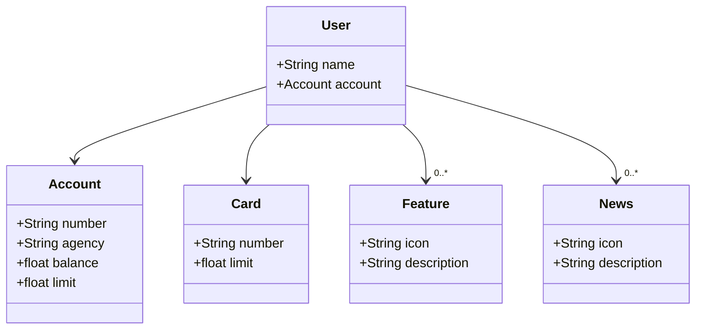

## Diagrama de classes

```mermaid
classDiagram
    class User {
        +String name
        +Account account
    }

    class Account {
        +String number
        +String agency
        +float balance
        +float limit
    }

    class Feature {
        +String icon
        +String description
    }

    class Card {
        +String number
        +float limit
    }

    class News {
        +String icon
        +String description
    }

    User --> Account
    User --> Card
    User --> "0..*" Feature 
    User --> "0..*" News
```
