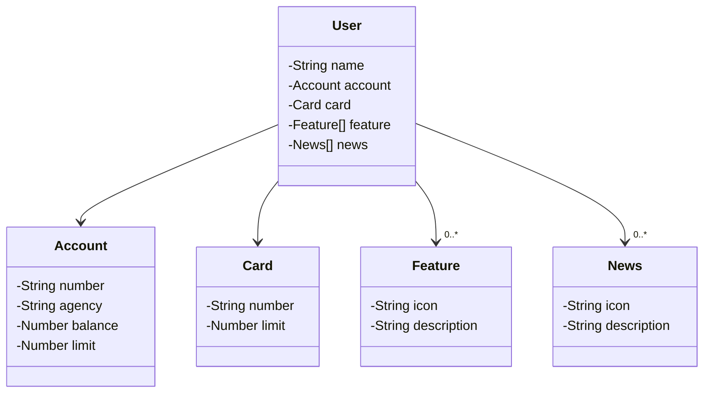

## Diagrama de classes

```mermaid
classDiagram
    class User {
        -String name
        -Account account
        -Card card
        -Feature[] feature
        -News[] news
    }

    class Account {
        -String number
        -String agency
        -Number balance
        -Number limit
    }

    class Feature {
        -String icon
        -String description
    }

    class Card {
        -String number
        -Number limit
    }

    class News {
        -String icon
        -String description
    }

    User --> Account
    User --> Card
    User --> "0..*" Feature 
    User --> "0..*" News
```
